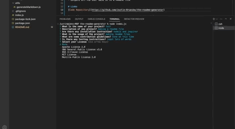

# the-readme-generator
Generates readme file

# Description
This project uses NodeJS and Inquirer to create a ReadMe file

# Completed Task
- Prompts users to answer questions for building the readme
- Uses that data to fill in the different sections
- Outputs all the user data in to a ReadMe file

# Links
[Code Repository](https://github.com/Justin-Brueske/the-readme-generator)

# Insatllation
You need to have NodeJS installed
And install Inquirer with the files

# Usage
Can be run with NodeJS

